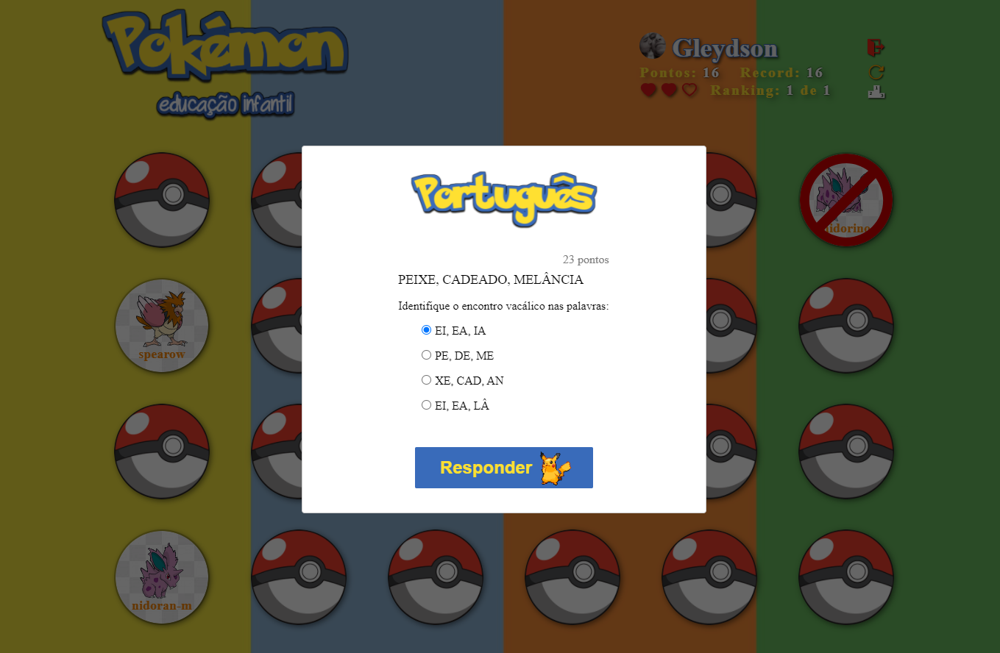

## 💻 Projeto POKEMON-EDU

O Pokemon Education tem como finalidade permitir que crianças possam práticar os ensinamentos adquiridos na escola de maneira lúdica usando a temática do jogo POKEMON.

<h2>🖥️ Tela de Login com Google Account: </h2>

  

<h2>🖥️ Dashboard: </h2>

  
  
  

## ✨ Tecnologias

Esse projeto foi desenvolvido com as seguintes tecnologias:

- [ReactJS](https://reactjs.org)
- [TypeScript](https://www.typescriptlang.org/)
- [SASS](https://sass-lang.com/)
- [Firebase](https://firebase.google.com/)

## 🚀 Aplicação disponível online

Você pode testar o Pokemon Education através [desse link](https://pokemon-education.web.app/).

## 🚀 Jogando

- Existe um total de 24 pokebolas, que para serem conquistadas deve ter seu desafio respondido corretamente.
- Cada usuário possui 3 vidas.
  - Para cada resposta errada, perde-se uma vida e a oportunidade de conquistar o pokemon da pokebola selecionada.
- Cada resposta correta resulta na conquista do pokemon e dos ponto, que variam de acordo com a complexidade da questão.
- A pontuação máxima de cada jogador fica salva em seu perfil como pontuação RECORDE.
- Existe um ranking do top 10 Jogadores.
- Caso o jogador queira reiniciar a partida, basta clicar no botão de recarregar ao lado de seu nome
  - Ao recarregar, o jogador receber suas vidas de volta (3) e seus pontos são igualados a 0.

## Aviso

- A aplicação está pendente de alguns pequenos ajustes e implementação de questões, atualmente existem apenas as seguintes matérias:
  - Português
  - Matemática

- Mais adiante deixarei o projeto responsivo

## 🚀 Como executar

- Clone o repositório
- Instale o [Node.js](https://nodejs.org/en/download/)
- Instale o [Yarn](https://classic.yarnpkg.com/en/docs/install/#windows-stable)
- Crie um projeto no [Firebase](https://firebase.google.com/)
- Adicione as credenciais do seu firebase em firebase.ts localizado na pasta services
- Ative o firebase authentication com a autenticação do google
- Inicie o servidor com `yarn start` no terminal

Agora você pode acessar [`localhost:3000`](http://localhost:3000) no seu navegador.

---

Feito por Gleydson Albuquerque de forma independente com o objetivo de prática.

Me encontre [aqui](https://www.linkedin.com/in/gleydson07/).
